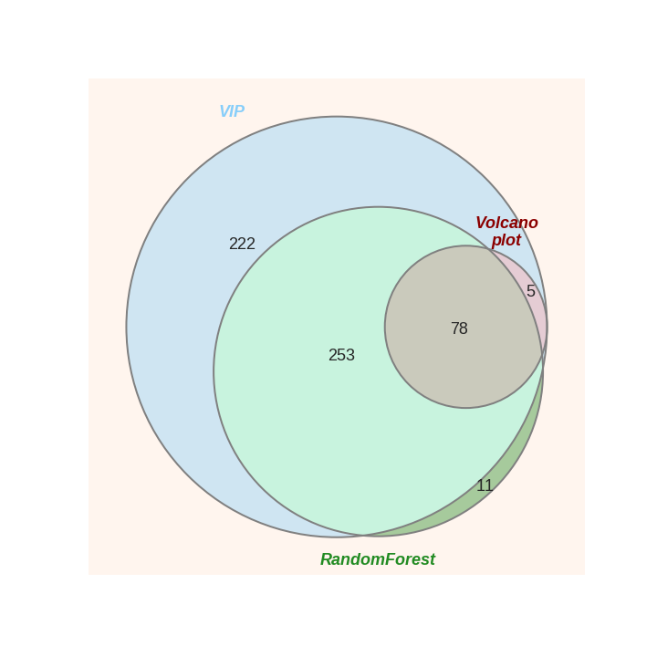

# Metabolomic
## 仅是项目一些数据的可视化结果
### PCA：QC, Samples  

### PCA components *vs.* inject order

### kde plot (RSD *vs.* intensities)

### signal distribution

### feature_importance in RF model

### venn

